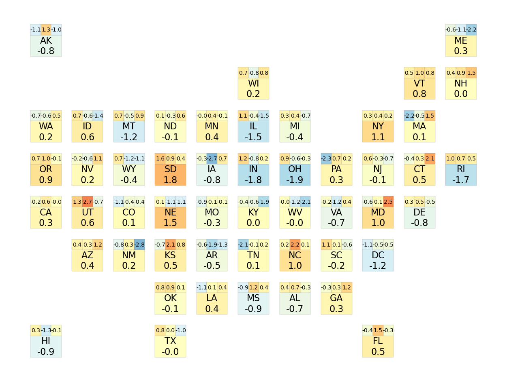
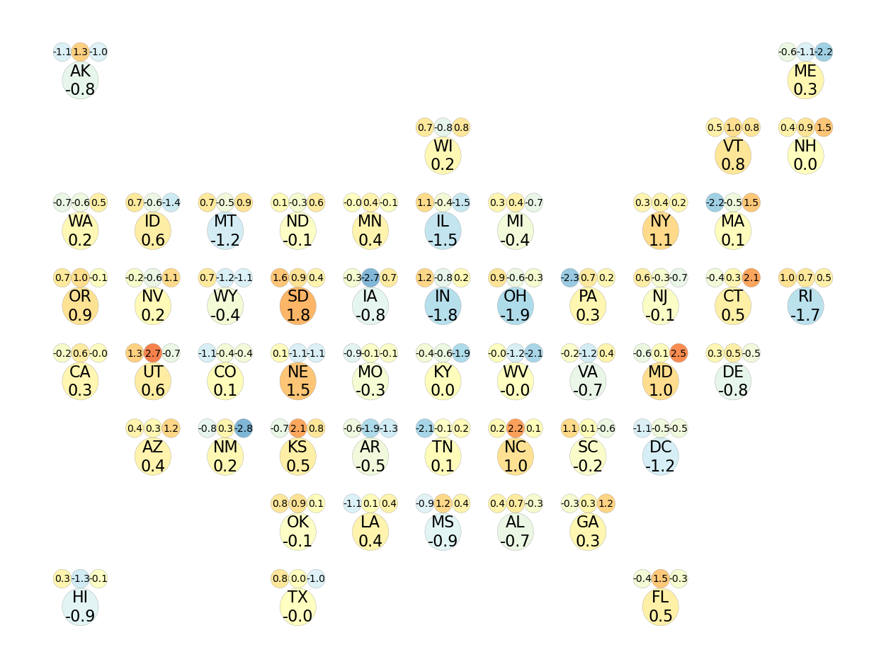

```python
import pandas as pd
import numpy as np
import geopandas as gp
import geojson
from matplotlib import pyplot as plt
```

# Intro
The 50 states in U.S. have different areas, ranging from 4,001 km2 (RI) to 1,723,337 km2 (AK). This could sometimes cause huge challenges in visualization since smaller states would be hard to represent. 

Using a matrix map could help solve this problem. By abstract the US map into same-sized shapes while preserving the relative geographical positions, we could convey the information more precisely without bias when the area doesn't matter.


## Prepare Map Matrix

First we can use a spreadsheet to build up a matrix to abstract the real map. It looks something like below.


```python
# Read in the data I prepared
us_map = pd.read_csv('desktop/OTD Goal/us_matrix_map.csv',header=None)
us_map
```


<div>
<style scoped>
    .dataframe tbody tr th:only-of-type {
        vertical-align: middle;
    }

    .dataframe tbody tr th {
        vertical-align: top;
    }

    .dataframe thead th {
        text-align: right;
    }
</style>
<table border="1" class="dataframe">
  <thead>
    <tr style="text-align: right;">
      <th></th>
      <th>0</th>
      <th>1</th>
      <th>2</th>
      <th>3</th>
      <th>4</th>
      <th>5</th>
      <th>6</th>
      <th>7</th>
      <th>8</th>
      <th>9</th>
      <th>10</th>
    </tr>
  </thead>
  <tbody>
    <tr>
      <th>0</th>
      <td>AK</td>
      <td>NaN</td>
      <td>NaN</td>
      <td>NaN</td>
      <td>NaN</td>
      <td>NaN</td>
      <td>NaN</td>
      <td>NaN</td>
      <td>NaN</td>
      <td>NaN</td>
      <td>ME</td>
    </tr>
    <tr>
      <th>1</th>
      <td>NaN</td>
      <td>NaN</td>
      <td>NaN</td>
      <td>NaN</td>
      <td>NaN</td>
      <td>WI</td>
      <td>NaN</td>
      <td>NaN</td>
      <td>NaN</td>
      <td>VT</td>
      <td>NH</td>
    </tr>
    <tr>
      <th>2</th>
      <td>WA</td>
      <td>ID</td>
      <td>MT</td>
      <td>ND</td>
      <td>MN</td>
      <td>IL</td>
      <td>MI</td>
      <td>NaN</td>
      <td>NY</td>
      <td>MA</td>
      <td>NaN</td>
    </tr>
    <tr>
      <th>3</th>
      <td>OR</td>
      <td>NV</td>
      <td>WY</td>
      <td>SD</td>
      <td>IA</td>
      <td>IN</td>
      <td>OH</td>
      <td>PA</td>
      <td>NJ</td>
      <td>CT</td>
      <td>RI</td>
    </tr>
    <tr>
      <th>4</th>
      <td>CA</td>
      <td>UT</td>
      <td>CO</td>
      <td>NE</td>
      <td>MO</td>
      <td>KY</td>
      <td>WV</td>
      <td>VA</td>
      <td>MD</td>
      <td>DE</td>
      <td>NaN</td>
    </tr>
    <tr>
      <th>5</th>
      <td>NaN</td>
      <td>AZ</td>
      <td>NM</td>
      <td>KS</td>
      <td>AR</td>
      <td>TN</td>
      <td>NC</td>
      <td>SC</td>
      <td>DC</td>
      <td>NaN</td>
      <td>NaN</td>
    </tr>
    <tr>
      <th>6</th>
      <td>NaN</td>
      <td>NaN</td>
      <td>NaN</td>
      <td>OK</td>
      <td>LA</td>
      <td>MS</td>
      <td>AL</td>
      <td>GA</td>
      <td>NaN</td>
      <td>NaN</td>
      <td>NaN</td>
    </tr>
    <tr>
      <th>7</th>
      <td>HI</td>
      <td>NaN</td>
      <td>NaN</td>
      <td>TX</td>
      <td>NaN</td>
      <td>NaN</td>
      <td>NaN</td>
      <td>NaN</td>
      <td>FL</td>
      <td>NaN</td>
      <td>NaN</td>
    </tr>
  </tbody>
</table>
</div>


```python
# Flatten the matrix
us_map = us_map.stack().reset_index()
us_map.columns = ['row','column','state']
us_map = us_map[us_map['state']!='']
us_map['row'] = us_map['row'].max() - us_map['row'] 
us_map.head()
```


<div>
<style scoped>
    .dataframe tbody tr th:only-of-type {
        vertical-align: middle;
    }

    .dataframe tbody tr th {
        vertical-align: top;
    }

    .dataframe thead th {
        text-align: right;
    }
</style>
<table border="1" class="dataframe">
  <thead>
    <tr style="text-align: right;">
      <th></th>
      <th>row</th>
      <th>column</th>
      <th>state</th>
    </tr>
  </thead>
  <tbody>
    <tr>
      <th>0</th>
      <td>7</td>
      <td>0</td>
      <td>AK</td>
    </tr>
    <tr>
      <th>1</th>
      <td>7</td>
      <td>10</td>
      <td>ME</td>
    </tr>
    <tr>
      <th>2</th>
      <td>6</td>
      <td>5</td>
      <td>WI</td>
    </tr>
    <tr>
      <th>3</th>
      <td>6</td>
      <td>9</td>
      <td>VT</td>
    </tr>
    <tr>
      <th>4</th>
      <td>6</td>
      <td>10</td>
      <td>NH</td>
    </tr>
  </tbody>
</table>
</div>


## Generate Geojson File
Now we use the geojson module to translate our prepared data into a geojson file.


```python
# Here I make a geojson file that can hold 1 overall value and 3 subtotal value for each state
features = []
value_holders = {'overall': {'start':[0,0], 'width':3, 'height':2},
          'subtotal1': {'start':[0,2], 'width':1, 'height':1},
          'subtotal2': {'start':[1,2], 'width':1, 'height':1},
          'subtotal3': {'start':[2,2], 'width':1, 'height':1}}
step = 4

for state in us_map.iterrows():
    state_name = state[1]['state']
    main_start_point_x = state[1]['column']
    main_start_point_y = state[1]['row']
    for value_holder in value_holders:
        aug = value_holders[value_holder]
        start_point_x = main_start_point_x * step + aug['start'][0] 
        start_point_y = main_start_point_y * step + aug['start'][1]
        feature = geojson.Feature(state_name, geojson.Polygon([[(start_point_x, start_point_y),
                                                                (start_point_x+aug['width'],start_point_y),
                                                                (start_point_x+aug['width'],start_point_y+aug['height']),
                                                                (start_point_x,start_point_y+aug['height']),
                                                                (start_point_x,start_point_y)]]), 
                                  properties={'type':value_holder})
        features.append(feature)
features = geojson.FeatureCollection(features)
print(features)

with open('us_matrix_map.geojson','w') as w:
    w.write(geojson.dumps(features))
```

    {"features": [{"geometry": {"coordinates": [[[0, 28], [3, 28], [3, 30], [0, 30], [0, 28]]], "type": "Polygon"}, "id": "AK", "properties": {"type": "overall"}, "type": "Feature"}, {"geometry": {"coordinates": [[[0, 30], [1, 30], [1, 31], [0, 31], [0, 30]]], "type": "Polygon"}, "id": "AK", "properties": {"type": "subtotal1"}, "type": "Feature"}, {"geometry": {"coordinates": [[[1, 30], [2, 30], [2, 31], [1, 31], [1, 30]]], "type": "Polygon"}, "id": "AK", "properties": {"type": "subtotal2"}, "type": "Feature"}, {"geometry": {"coordinates": [[[2, 30], [3, 30], [3, 31], [2, 31], [2, 30]]], "type": "Polygon"}, "id": "AK", "properties": {"type": "subtotal3"}, "type": "Feature"}, {"geometry": {"coordinates": [[[40, 28], [43, 28], [43, 30], [40, 30], [40, 28]]], "type": "Polygon"}, "id": "ME", "properties": {"type": "overall"}, "type": "Feature"}, {"geometry": {"coordinates": [[[40, 30], [41, 30], [41, 31], [40, 31], [40, 30]]], "type": "Polygon"}, "id": "ME", "properties": {"type": "subtotal1"}, "type": "Feature"}, {"geometry": {"coordinates": [[[41, 30], [42, 30], [42, 31], [41, 31], [41, 30]]], "type": "Polygon"}, "id": "ME", "properties": {"type": "subtotal2"}, "type": "Feature"}, {"geometry": {"coordinates": [[[42, 30], [43, 30], [43, 31], [42, 31], [42, 30]]], "type": "Polygon"}, "id": "ME", "properties": {"type": "subtotal3"}, "type": "Feature"}, {"geometry": {"coordinates": [[[20, 24], [23, 24], [23, 26], [20, 26], [20, 24]]], "type": "Polygon"}, "id": "WI", "properties": {"type": "overall"}, "type": "Feature"}, {"geometry": {"coordinates": [[[20, 26], [21, 26], [21, 27], [20, 27], [20, 26]]], "type": "Polygon"}, "id": "WI", "properties": {"type": "subtotal1"}, "type": "Feature"}, {"geometry": {"coordinates": [[[21, 26], [22, 26], [22, 27], [21, 27], [21, 26]]], "type": "Polygon"}, "id": "WI", "properties": {"type": "subtotal2"}, "type": "Feature"}, {"geometry": {"coordinates": [[[22, 26], [23, 26], [23, 27], [22, 27], [22, 26]]], "type": "Polygon"}, "id": "WI", "properties": {"type": "subtotal3"}, "type": "Feature"}, {"geometry": {"coordinates": [[[36, 24], [39, 24], [39, 26], [36, 26], [36, 24]]], "type": "Polygon"}, "id": "VT", "properties": {"type": "overall"}, "type": "Feature"}, {"geometry": {"coordinates": [[[36, 26], [37, 26], [37, 27], [36, 27], [36, 26]]], "type": "Polygon"}, "id": "VT", "properties": {"type": "subtotal1"}, "type": "Feature"}, {"geometry": {"coordinates": [[[37, 26], [38, 26], [38, 27], [37, 27], [37, 26]]], "type": "Polygon"}, "id": "VT", "properties": {"type": "subtotal2"}, "type": "Feature"}, {"geometry": {"coordinates": [[[38, 26], [39, 26], [39, 27], [38, 27], [38, 26]]], "type": "Polygon"}, "id": "VT", "properties": {"type": "subtotal3"}, "type": "Feature"}, {"geometry": {"coordinates": [[[40, 24], [43, 24], [43, 26], [40, 26], [40, 24]]], "type": "Polygon"}, "id": "NH", "properties": {"type": "overall"}, "type": "Feature"}, {"geometry": {"coordinates": [[[40, 26], [41, 26], [41, 27], [40, 27], [40, 26]]], "type": "Polygon"}, "id": "NH", "properties": {"type": "subtotal1"}, "type": "Feature"}, {"geometry": {"coordinates": [[[41, 26], [42, 26], [42, 27], [41, 27], [41, 26]]], "type": "Polygon"}, "id": "NH", "properties": {"type": "subtotal2"}, "type": "Feature"}, {"geometry": {"coordinates": [[[42, 26], [43, 26], [43, 27], [42, 27], [42, 26]]], "type": "Polygon"}, "id": "NH", "properties": {"type": "subtotal3"}, "type": "Feature"}, {"geometry": {"coordinates": [[[0, 20], [3, 20], [3, 22], [0, 22], [0, 20]]], "type": "Polygon"}, "id": "WA", "properties": {"type": "overall"}, "type": "Feature"}, {"geometry": {"coordinates": [[[0, 22], [1, 22], [1, 23], [0, 23], [0, 22]]], "type": "Polygon"}, "id": "WA", "properties": {"type": "subtotal1"}, "type": "Feature"}, {"geometry": {"coordinates": [[[1, 22], [2, 22], [2, 23], [1, 23], [1, 22]]], "type": "Polygon"}, "id": "WA", "properties": {"type": "subtotal2"}, "type": "Feature"}, {"geometry": {"coordinates": [[[2, 22], [3, 22], [3, 23], [2, 23], [2, 22]]], "type": "Polygon"}, "id": "WA", "properties": {"type": "subtotal3"}, "type": "Feature"}, {"geometry": {"coordinates": [[[4, 20], [7, 20], [7, 22], [4, 22], [4, 20]]], "type": "Polygon"}, "id": "ID", "properties": {"type": "overall"}, "type": "Feature"}, {"geometry": {"coordinates": [[[4, 22], [5, 22], [5, 23], [4, 23], [4, 22]]], "type": "Polygon"}, "id": "ID", "properties": {"type": "subtotal1"}, "type": "Feature"}, {"geometry": {"coordinates": [[[5, 22], [6, 22], [6, 23], [5, 23], [5, 22]]], "type": "Polygon"}, "id": "ID", "properties": {"type": "subtotal2"}, "type": "Feature"}, {"geometry": {"coordinates": [[[6, 22], [7, 22], [7, 23], [6, 23], [6, 22]]], "type": "Polygon"}, "id": "ID", "properties": {"type": "subtotal3"}, "type": "Feature"}, {"geometry": {"coordinates": [[[8, 20], [11, 20], [11, 22], [8, 22], [8, 20]]], "type": "Polygon"}, "id": "MT", "properties": {"type": "overall"}, "type": "Feature"}, {"geometry": {"coordinates": [[[8, 22], [9, 22], [9, 23], [8, 23], [8, 22]]], "type": "Polygon"}, "id": "MT", "properties": {"type": "subtotal1"}, "type": "Feature"}, {"geometry": {"coordinates": [[[9, 22], [10, 22], [10, 23], [9, 23], [9, 22]]], "type": "Polygon"}, "id": "MT", "properties": {"type": "subtotal2"}, "type": "Feature"}, {"geometry": {"coordinates": [[[10, 22], [11, 22], [11, 23], [10, 23], [10, 22]]], "type": "Polygon"}, "id": "MT", "properties": {"type": "subtotal3"}, "type": "Feature"}, {"geometry": {"coordinates": [[[12, 20], [15, 20], [15, 22], [12, 22], [12, 20]]], "type": "Polygon"}, "id": "ND", "properties": {"type": "overall"}, "type": "Feature"}, {"geometry": {"coordinates": [[[12, 22], [13, 22], [13, 23], [12, 23], [12, 22]]], "type": "Polygon"}, "id": "ND", "properties": {"type": "subtotal1"}, "type": "Feature"}, {"geometry": {"coordinates": [[[13, 22], [14, 22], [14, 23], [13, 23], [13, 22]]], "type": "Polygon"}, "id": "ND", "properties": {"type": "subtotal2"}, "type": "Feature"}, {"geometry": {"coordinates": [[[14, 22], [15, 22], [15, 23], [14, 23], [14, 22]]], "type": "Polygon"}, "id": "ND", "properties": {"type": "subtotal3"}, "type": "Feature"}, {"geometry": {"coordinates": [[[16, 20], [19, 20], [19, 22], [16, 22], [16, 20]]], "type": "Polygon"}, "id": "MN", "properties": {"type": "overall"}, "type": "Feature"}, {"geometry": {"coordinates": [[[16, 22], [17, 22], [17, 23], [16, 23], [16, 22]]], "type": "Polygon"}, "id": "MN", "properties": {"type": "subtotal1"}, "type": "Feature"}, {"geometry": {"coordinates": [[[17, 22], [18, 22], [18, 23], [17, 23], [17, 22]]], "type": "Polygon"}, "id": "MN", "properties": {"type": "subtotal2"}, "type": "Feature"}, {"geometry": {"coordinates": [[[18, 22], [19, 22], [19, 23], [18, 23], [18, 22]]], "type": "Polygon"}, "id": "MN", "properties": {"type": "subtotal3"}, "type": "Feature"}, {"geometry": {"coordinates": [[[20, 20], [23, 20], [23, 22], [20, 22], [20, 20]]], "type": "Polygon"}, "id": "IL", "properties": {"type": "overall"}, "type": "Feature"}, {"geometry": {"coordinates": [[[20, 22], [21, 22], [21, 23], [20, 23], [20, 22]]], "type": "Polygon"}, "id": "IL", "properties": {"type": "subtotal1"}, "type": "Feature"}, {"geometry": {"coordinates": [[[21, 22], [22, 22], [22, 23], [21, 23], [21, 22]]], "type": "Polygon"}, "id": "IL", "properties": {"type": "subtotal2"}, "type": "Feature"}, {"geometry": {"coordinates": [[[22, 22], [23, 22], [23, 23], [22, 23], [22, 22]]], "type": "Polygon"}, "id": "IL", "properties": {"type": "subtotal3"}, "type": "Feature"}, {"geometry": {"coordinates": [[[24, 20], [27, 20], [27, 22], [24, 22], [24, 20]]], "type": "Polygon"}, "id": "MI", "properties": {"type": "overall"}, "type": "Feature"}, {"geometry": {"coordinates": [[[24, 22], [25, 22], [25, 23], [24, 23], [24, 22]]], "type": "Polygon"}, "id": "MI", "properties": {"type": "subtotal1"}, "type": "Feature"}, {"geometry": {"coordinates": [[[25, 22], [26, 22], [26, 23], [25, 23], [25, 22]]], "type": "Polygon"}, "id": "MI", "properties": {"type": "subtotal2"}, "type": "Feature"}, {"geometry": {"coordinates": [[[26, 22], [27, 22], [27, 23], [26, 23], [26, 22]]], "type": "Polygon"}, "id": "MI", "properties": {"type": "subtotal3"}, "type": "Feature"}, {"geometry": {"coordinates": [[[32, 20], [35, 20], [35, 22], [32, 22], [32, 20]]], "type": "Polygon"}, "id": "NY", "properties": {"type": "overall"}, "type": "Feature"}, {"geometry": {"coordinates": [[[32, 22], [33, 22], [33, 23], [32, 23], [32, 22]]], "type": "Polygon"}, "id": "NY", "properties": {"type": "subtotal1"}, "type": "Feature"}, {"geometry": {"coordinates": [[[33, 22], [34, 22], [34, 23], [33, 23], [33, 22]]], "type": "Polygon"}, "id": "NY", "properties": {"type": "subtotal2"}, "type": "Feature"}, {"geometry": {"coordinates": [[[34, 22], [35, 22], [35, 23], [34, 23], [34, 22]]], "type": "Polygon"}, "id": "NY", "properties": {"type": "subtotal3"}, "type": "Feature"}, {"geometry": {"coordinates": [[[36, 20], [39, 20], [39, 22], [36, 22], [36, 20]]], "type": "Polygon"}, "id": "MA", "properties": {"type": "overall"}, "type": "Feature"}, {"geometry": {"coordinates": [[[36, 22], [37, 22], [37, 23], [36, 23], [36, 22]]], "type": "Polygon"}, "id": "MA", "properties": {"type": "subtotal1"}, "type": "Feature"}, {"geometry": {"coordinates": [[[37, 22], [38, 22], [38, 23], [37, 23], [37, 22]]], "type": "Polygon"}, "id": "MA", "properties": {"type": "subtotal2"}, "type": "Feature"}, {"geometry": {"coordinates": [[[38, 22], [39, 22], [39, 23], [38, 23], [38, 22]]], "type": "Polygon"}, "id": "MA", "properties": {"type": "subtotal3"}, "type": "Feature"}, {"geometry": {"coordinates": [[[0, 16], [3, 16], [3, 18], [0, 18], [0, 16]]], "type": "Polygon"}, "id": "OR", "properties": {"type": "overall"}, "type": "Feature"}, {"geometry": {"coordinates": [[[0, 18], [1, 18], [1, 19], [0, 19], [0, 18]]], "type": "Polygon"}, "id": "OR", "properties": {"type": "subtotal1"}, "type": "Feature"}, {"geometry": {"coordinates": [[[1, 18], [2, 18], [2, 19], [1, 19], [1, 18]]], "type": "Polygon"}, "id": "OR", "properties": {"type": "subtotal2"}, "type": "Feature"}, {"geometry": {"coordinates": [[[2, 18], [3, 18], [3, 19], [2, 19], [2, 18]]], "type": "Polygon"}, "id": "OR", "properties": {"type": "subtotal3"}, "type": "Feature"}, {"geometry": {"coordinates": [[[4, 16], [7, 16], [7, 18], [4, 18], [4, 16]]], "type": "Polygon"}, "id": "NV", "properties": {"type": "overall"}, "type": "Feature"}, {"geometry": {"coordinates": [[[4, 18], [5, 18], [5, 19], [4, 19], [4, 18]]], "type": "Polygon"}, "id": "NV", "properties": {"type": "subtotal1"}, "type": "Feature"}, {"geometry": {"coordinates": [[[5, 18], [6, 18], [6, 19], [5, 19], [5, 18]]], "type": "Polygon"}, "id": "NV", "properties": {"type": "subtotal2"}, "type": "Feature"}, {"geometry": {"coordinates": [[[6, 18], [7, 18], [7, 19], [6, 19], [6, 18]]], "type": "Polygon"}, "id": "NV", "properties": {"type": "subtotal3"}, "type": "Feature"}, {"geometry": {"coordinates": [[[8, 16], [11, 16], [11, 18], [8, 18], [8, 16]]], "type": "Polygon"}, "id": "WY", "properties": {"type": "overall"}, "type": "Feature"}, {"geometry": {"coordinates": [[[8, 18], [9, 18], [9, 19], [8, 19], [8, 18]]], "type": "Polygon"}, "id": "WY", "properties": {"type": "subtotal1"}, "type": "Feature"}, {"geometry": {"coordinates": [[[9, 18], [10, 18], [10, 19], [9, 19], [9, 18]]], "type": "Polygon"}, "id": "WY", "properties": {"type": "subtotal2"}, "type": "Feature"}, {"geometry": {"coordinates": [[[10, 18], [11, 18], [11, 19], [10, 19], [10, 18]]], "type": "Polygon"}, "id": "WY", "properties": {"type": "subtotal3"}, "type": "Feature"}, {"geometry": {"coordinates": [[[12, 16], [15, 16], [15, 18], [12, 18], [12, 16]]], "type": "Polygon"}, "id": "SD", "properties": {"type": "overall"}, "type": "Feature"}, {"geometry": {"coordinates": [[[12, 18], [13, 18], [13, 19], [12, 19], [12, 18]]], "type": "Polygon"}, "id": "SD", "properties": {"type": "subtotal1"}, "type": "Feature"}, {"geometry": {"coordinates": [[[13, 18], [14, 18], [14, 19], [13, 19], [13, 18]]], "type": "Polygon"}, "id": "SD", "properties": {"type": "subtotal2"}, "type": "Feature"}, {"geometry": {"coordinates": [[[14, 18], [15, 18], [15, 19], [14, 19], [14, 18]]], "type": "Polygon"}, "id": "SD", "properties": {"type": "subtotal3"}, "type": "Feature"}, {"geometry": {"coordinates": [[[16, 16], [19, 16], [19, 18], [16, 18], [16, 16]]], "type": "Polygon"}, "id": "IA", "properties": {"type": "overall"}, "type": "Feature"}, {"geometry": {"coordinates": [[[16, 18], [17, 18], [17, 19], [16, 19], [16, 18]]], "type": "Polygon"}, "id": "IA", "properties": {"type": "subtotal1"}, "type": "Feature"}, {"geometry": {"coordinates": [[[17, 18], [18, 18], [18, 19], [17, 19], [17, 18]]], "type": "Polygon"}, "id": "IA", "properties": {"type": "subtotal2"}, "type": "Feature"}, {"geometry": {"coordinates": [[[18, 18], [19, 18], [19, 19], [18, 19], [18, 18]]], "type": "Polygon"}, "id": "IA", "properties": {"type": "subtotal3"}, "type": "Feature"}, {"geometry": {"coordinates": [[[20, 16], [23, 16], [23, 18], [20, 18], [20, 16]]], "type": "Polygon"}, "id": "IN", "properties": {"type": "overall"}, "type": "Feature"}, {"geometry": {"coordinates": [[[20, 18], [21, 18], [21, 19], [20, 19], [20, 18]]], "type": "Polygon"}, "id": "IN", "properties": {"type": "subtotal1"}, "type": "Feature"}, {"geometry": {"coordinates": [[[21, 18], [22, 18], [22, 19], [21, 19], [21, 18]]], "type": "Polygon"}, "id": "IN", "properties": {"type": "subtotal2"}, "type": "Feature"}, {"geometry": {"coordinates": [[[22, 18], [23, 18], [23, 19], [22, 19], [22, 18]]], "type": "Polygon"}, "id": "IN", "properties": {"type": "subtotal3"}, "type": "Feature"}, {"geometry": {"coordinates": [[[24, 16], [27, 16], [27, 18], [24, 18], [24, 16]]], "type": "Polygon"}, "id": "OH", "properties": {"type": "overall"}, "type": "Feature"}, {"geometry": {"coordinates": [[[24, 18], [25, 18], [25, 19], [24, 19], [24, 18]]], "type": "Polygon"}, "id": "OH", "properties": {"type": "subtotal1"}, "type": "Feature"}, {"geometry": {"coordinates": [[[25, 18], [26, 18], [26, 19], [25, 19], [25, 18]]], "type": "Polygon"}, "id": "OH", "properties": {"type": "subtotal2"}, "type": "Feature"}, {"geometry": {"coordinates": [[[26, 18], [27, 18], [27, 19], [26, 19], [26, 18]]], "type": "Polygon"}, "id": "OH", "properties": {"type": "subtotal3"}, "type": "Feature"}, {"geometry": {"coordinates": [[[28, 16], [31, 16], [31, 18], [28, 18], [28, 16]]], "type": "Polygon"}, "id": "PA", "properties": {"type": "overall"}, "type": "Feature"}, {"geometry": {"coordinates": [[[28, 18], [29, 18], [29, 19], [28, 19], [28, 18]]], "type": "Polygon"}, "id": "PA", "properties": {"type": "subtotal1"}, "type": "Feature"}, {"geometry": {"coordinates": [[[29, 18], [30, 18], [30, 19], [29, 19], [29, 18]]], "type": "Polygon"}, "id": "PA", "properties": {"type": "subtotal2"}, "type": "Feature"}, {"geometry": {"coordinates": [[[30, 18], [31, 18], [31, 19], [30, 19], [30, 18]]], "type": "Polygon"}, "id": "PA", "properties": {"type": "subtotal3"}, "type": "Feature"}, {"geometry": {"coordinates": [[[32, 16], [35, 16], [35, 18], [32, 18], [32, 16]]], "type": "Polygon"}, "id": "NJ", "properties": {"type": "overall"}, "type": "Feature"}, {"geometry": {"coordinates": [[[32, 18], [33, 18], [33, 19], [32, 19], [32, 18]]], "type": "Polygon"}, "id": "NJ", "properties": {"type": "subtotal1"}, "type": "Feature"}, {"geometry": {"coordinates": [[[33, 18], [34, 18], [34, 19], [33, 19], [33, 18]]], "type": "Polygon"}, "id": "NJ", "properties": {"type": "subtotal2"}, "type": "Feature"}, {"geometry": {"coordinates": [[[34, 18], [35, 18], [35, 19], [34, 19], [34, 18]]], "type": "Polygon"}, "id": "NJ", "properties": {"type": "subtotal3"}, "type": "Feature"}, {"geometry": {"coordinates": [[[36, 16], [39, 16], [39, 18], [36, 18], [36, 16]]], "type": "Polygon"}, "id": "CT", "properties": {"type": "overall"}, "type": "Feature"}, {"geometry": {"coordinates": [[[36, 18], [37, 18], [37, 19], [36, 19], [36, 18]]], "type": "Polygon"}, "id": "CT", "properties": {"type": "subtotal1"}, "type": "Feature"}, {"geometry": {"coordinates": [[[37, 18], [38, 18], [38, 19], [37, 19], [37, 18]]], "type": "Polygon"}, "id": "CT", "properties": {"type": "subtotal2"}, "type": "Feature"}, {"geometry": {"coordinates": [[[38, 18], [39, 18], [39, 19], [38, 19], [38, 18]]], "type": "Polygon"}, "id": "CT", "properties": {"type": "subtotal3"}, "type": "Feature"}, {"geometry": {"coordinates": [[[40, 16], [43, 16], [43, 18], [40, 18], [40, 16]]], "type": "Polygon"}, "id": "RI", "properties": {"type": "overall"}, "type": "Feature"}, {"geometry": {"coordinates": [[[40, 18], [41, 18], [41, 19], [40, 19], [40, 18]]], "type": "Polygon"}, "id": "RI", "properties": {"type": "subtotal1"}, "type": "Feature"}, {"geometry": {"coordinates": [[[41, 18], [42, 18], [42, 19], [41, 19], [41, 18]]], "type": "Polygon"}, "id": "RI", "properties": {"type": "subtotal2"}, "type": "Feature"}, {"geometry": {"coordinates": [[[42, 18], [43, 18], [43, 19], [42, 19], [42, 18]]], "type": "Polygon"}, "id": "RI", "properties": {"type": "subtotal3"}, "type": "Feature"}, {"geometry": {"coordinates": [[[0, 12], [3, 12], [3, 14], [0, 14], [0, 12]]], "type": "Polygon"}, "id": "CA", "properties": {"type": "overall"}, "type": "Feature"}, {"geometry": {"coordinates": [[[0, 14], [1, 14], [1, 15], [0, 15], [0, 14]]], "type": "Polygon"}, "id": "CA", "properties": {"type": "subtotal1"}, "type": "Feature"}, {"geometry": {"coordinates": [[[1, 14], [2, 14], [2, 15], [1, 15], [1, 14]]], "type": "Polygon"}, "id": "CA", "properties": {"type": "subtotal2"}, "type": "Feature"}, {"geometry": {"coordinates": [[[2, 14], [3, 14], [3, 15], [2, 15], [2, 14]]], "type": "Polygon"}, "id": "CA", "properties": {"type": "subtotal3"}, "type": "Feature"}, {"geometry": {"coordinates": [[[4, 12], [7, 12], [7, 14], [4, 14], [4, 12]]], "type": "Polygon"}, "id": "UT", "properties": {"type": "overall"}, "type": "Feature"}, {"geometry": {"coordinates": [[[4, 14], [5, 14], [5, 15], [4, 15], [4, 14]]], "type": "Polygon"}, "id": "UT", "properties": {"type": "subtotal1"}, "type": "Feature"}, {"geometry": {"coordinates": [[[5, 14], [6, 14], [6, 15], [5, 15], [5, 14]]], "type": "Polygon"}, "id": "UT", "properties": {"type": "subtotal2"}, "type": "Feature"}, {"geometry": {"coordinates": [[[6, 14], [7, 14], [7, 15], [6, 15], [6, 14]]], "type": "Polygon"}, "id": "UT", "properties": {"type": "subtotal3"}, "type": "Feature"}, {"geometry": {"coordinates": [[[8, 12], [11, 12], [11, 14], [8, 14], [8, 12]]], "type": "Polygon"}, "id": "CO", "properties": {"type": "overall"}, "type": "Feature"}, {"geometry": {"coordinates": [[[8, 14], [9, 14], [9, 15], [8, 15], [8, 14]]], "type": "Polygon"}, "id": "CO", "properties": {"type": "subtotal1"}, "type": "Feature"}, {"geometry": {"coordinates": [[[9, 14], [10, 14], [10, 15], [9, 15], [9, 14]]], "type": "Polygon"}, "id": "CO", "properties": {"type": "subtotal2"}, "type": "Feature"}, {"geometry": {"coordinates": [[[10, 14], [11, 14], [11, 15], [10, 15], [10, 14]]], "type": "Polygon"}, "id": "CO", "properties": {"type": "subtotal3"}, "type": "Feature"}, {"geometry": {"coordinates": [[[12, 12], [15, 12], [15, 14], [12, 14], [12, 12]]], "type": "Polygon"}, "id": "NE", "properties": {"type": "overall"}, "type": "Feature"}, {"geometry": {"coordinates": [[[12, 14], [13, 14], [13, 15], [12, 15], [12, 14]]], "type": "Polygon"}, "id": "NE", "properties": {"type": "subtotal1"}, "type": "Feature"}, {"geometry": {"coordinates": [[[13, 14], [14, 14], [14, 15], [13, 15], [13, 14]]], "type": "Polygon"}, "id": "NE", "properties": {"type": "subtotal2"}, "type": "Feature"}, {"geometry": {"coordinates": [[[14, 14], [15, 14], [15, 15], [14, 15], [14, 14]]], "type": "Polygon"}, "id": "NE", "properties": {"type": "subtotal3"}, "type": "Feature"}, {"geometry": {"coordinates": [[[16, 12], [19, 12], [19, 14], [16, 14], [16, 12]]], "type": "Polygon"}, "id": "MO", "properties": {"type": "overall"}, "type": "Feature"}, {"geometry": {"coordinates": [[[16, 14], [17, 14], [17, 15], [16, 15], [16, 14]]], "type": "Polygon"}, "id": "MO", "properties": {"type": "subtotal1"}, "type": "Feature"}, {"geometry": {"coordinates": [[[17, 14], [18, 14], [18, 15], [17, 15], [17, 14]]], "type": "Polygon"}, "id": "MO", "properties": {"type": "subtotal2"}, "type": "Feature"}, {"geometry": {"coordinates": [[[18, 14], [19, 14], [19, 15], [18, 15], [18, 14]]], "type": "Polygon"}, "id": "MO", "properties": {"type": "subtotal3"}, "type": "Feature"}, {"geometry": {"coordinates": [[[20, 12], [23, 12], [23, 14], [20, 14], [20, 12]]], "type": "Polygon"}, "id": "KY", "properties": {"type": "overall"}, "type": "Feature"}, {"geometry": {"coordinates": [[[20, 14], [21, 14], [21, 15], [20, 15], [20, 14]]], "type": "Polygon"}, "id": "KY", "properties": {"type": "subtotal1"}, "type": "Feature"}, {"geometry": {"coordinates": [[[21, 14], [22, 14], [22, 15], [21, 15], [21, 14]]], "type": "Polygon"}, "id": "KY", "properties": {"type": "subtotal2"}, "type": "Feature"}, {"geometry": {"coordinates": [[[22, 14], [23, 14], [23, 15], [22, 15], [22, 14]]], "type": "Polygon"}, "id": "KY", "properties": {"type": "subtotal3"}, "type": "Feature"}, {"geometry": {"coordinates": [[[24, 12], [27, 12], [27, 14], [24, 14], [24, 12]]], "type": "Polygon"}, "id": "WV", "properties": {"type": "overall"}, "type": "Feature"}, {"geometry": {"coordinates": [[[24, 14], [25, 14], [25, 15], [24, 15], [24, 14]]], "type": "Polygon"}, "id": "WV", "properties": {"type": "subtotal1"}, "type": "Feature"}, {"geometry": {"coordinates": [[[25, 14], [26, 14], [26, 15], [25, 15], [25, 14]]], "type": "Polygon"}, "id": "WV", "properties": {"type": "subtotal2"}, "type": "Feature"}, {"geometry": {"coordinates": [[[26, 14], [27, 14], [27, 15], [26, 15], [26, 14]]], "type": "Polygon"}, "id": "WV", "properties": {"type": "subtotal3"}, "type": "Feature"}, {"geometry": {"coordinates": [[[28, 12], [31, 12], [31, 14], [28, 14], [28, 12]]], "type": "Polygon"}, "id": "VA", "properties": {"type": "overall"}, "type": "Feature"}, {"geometry": {"coordinates": [[[28, 14], [29, 14], [29, 15], [28, 15], [28, 14]]], "type": "Polygon"}, "id": "VA", "properties": {"type": "subtotal1"}, "type": "Feature"}, {"geometry": {"coordinates": [[[29, 14], [30, 14], [30, 15], [29, 15], [29, 14]]], "type": "Polygon"}, "id": "VA", "properties": {"type": "subtotal2"}, "type": "Feature"}, {"geometry": {"coordinates": [[[30, 14], [31, 14], [31, 15], [30, 15], [30, 14]]], "type": "Polygon"}, "id": "VA", "properties": {"type": "subtotal3"}, "type": "Feature"}, {"geometry": {"coordinates": [[[32, 12], [35, 12], [35, 14], [32, 14], [32, 12]]], "type": "Polygon"}, "id": "MD", "properties": {"type": "overall"}, "type": "Feature"}, {"geometry": {"coordinates": [[[32, 14], [33, 14], [33, 15], [32, 15], [32, 14]]], "type": "Polygon"}, "id": "MD", "properties": {"type": "subtotal1"}, "type": "Feature"}, {"geometry": {"coordinates": [[[33, 14], [34, 14], [34, 15], [33, 15], [33, 14]]], "type": "Polygon"}, "id": "MD", "properties": {"type": "subtotal2"}, "type": "Feature"}, {"geometry": {"coordinates": [[[34, 14], [35, 14], [35, 15], [34, 15], [34, 14]]], "type": "Polygon"}, "id": "MD", "properties": {"type": "subtotal3"}, "type": "Feature"}, {"geometry": {"coordinates": [[[36, 12], [39, 12], [39, 14], [36, 14], [36, 12]]], "type": "Polygon"}, "id": "DE", "properties": {"type": "overall"}, "type": "Feature"}, {"geometry": {"coordinates": [[[36, 14], [37, 14], [37, 15], [36, 15], [36, 14]]], "type": "Polygon"}, "id": "DE", "properties": {"type": "subtotal1"}, "type": "Feature"}, {"geometry": {"coordinates": [[[37, 14], [38, 14], [38, 15], [37, 15], [37, 14]]], "type": "Polygon"}, "id": "DE", "properties": {"type": "subtotal2"}, "type": "Feature"}, {"geometry": {"coordinates": [[[38, 14], [39, 14], [39, 15], [38, 15], [38, 14]]], "type": "Polygon"}, "id": "DE", "properties": {"type": "subtotal3"}, "type": "Feature"}, {"geometry": {"coordinates": [[[4, 8], [7, 8], [7, 10], [4, 10], [4, 8]]], "type": "Polygon"}, "id": "AZ", "properties": {"type": "overall"}, "type": "Feature"}, {"geometry": {"coordinates": [[[4, 10], [5, 10], [5, 11], [4, 11], [4, 10]]], "type": "Polygon"}, "id": "AZ", "properties": {"type": "subtotal1"}, "type": "Feature"}, {"geometry": {"coordinates": [[[5, 10], [6, 10], [6, 11], [5, 11], [5, 10]]], "type": "Polygon"}, "id": "AZ", "properties": {"type": "subtotal2"}, "type": "Feature"}, {"geometry": {"coordinates": [[[6, 10], [7, 10], [7, 11], [6, 11], [6, 10]]], "type": "Polygon"}, "id": "AZ", "properties": {"type": "subtotal3"}, "type": "Feature"}, {"geometry": {"coordinates": [[[8, 8], [11, 8], [11, 10], [8, 10], [8, 8]]], "type": "Polygon"}, "id": "NM", "properties": {"type": "overall"}, "type": "Feature"}, {"geometry": {"coordinates": [[[8, 10], [9, 10], [9, 11], [8, 11], [8, 10]]], "type": "Polygon"}, "id": "NM", "properties": {"type": "subtotal1"}, "type": "Feature"}, {"geometry": {"coordinates": [[[9, 10], [10, 10], [10, 11], [9, 11], [9, 10]]], "type": "Polygon"}, "id": "NM", "properties": {"type": "subtotal2"}, "type": "Feature"}, {"geometry": {"coordinates": [[[10, 10], [11, 10], [11, 11], [10, 11], [10, 10]]], "type": "Polygon"}, "id": "NM", "properties": {"type": "subtotal3"}, "type": "Feature"}, {"geometry": {"coordinates": [[[12, 8], [15, 8], [15, 10], [12, 10], [12, 8]]], "type": "Polygon"}, "id": "KS", "properties": {"type": "overall"}, "type": "Feature"}, {"geometry": {"coordinates": [[[12, 10], [13, 10], [13, 11], [12, 11], [12, 10]]], "type": "Polygon"}, "id": "KS", "properties": {"type": "subtotal1"}, "type": "Feature"}, {"geometry": {"coordinates": [[[13, 10], [14, 10], [14, 11], [13, 11], [13, 10]]], "type": "Polygon"}, "id": "KS", "properties": {"type": "subtotal2"}, "type": "Feature"}, {"geometry": {"coordinates": [[[14, 10], [15, 10], [15, 11], [14, 11], [14, 10]]], "type": "Polygon"}, "id": "KS", "properties": {"type": "subtotal3"}, "type": "Feature"}, {"geometry": {"coordinates": [[[16, 8], [19, 8], [19, 10], [16, 10], [16, 8]]], "type": "Polygon"}, "id": "AR", "properties": {"type": "overall"}, "type": "Feature"}, {"geometry": {"coordinates": [[[16, 10], [17, 10], [17, 11], [16, 11], [16, 10]]], "type": "Polygon"}, "id": "AR", "properties": {"type": "subtotal1"}, "type": "Feature"}, {"geometry": {"coordinates": [[[17, 10], [18, 10], [18, 11], [17, 11], [17, 10]]], "type": "Polygon"}, "id": "AR", "properties": {"type": "subtotal2"}, "type": "Feature"}, {"geometry": {"coordinates": [[[18, 10], [19, 10], [19, 11], [18, 11], [18, 10]]], "type": "Polygon"}, "id": "AR", "properties": {"type": "subtotal3"}, "type": "Feature"}, {"geometry": {"coordinates": [[[20, 8], [23, 8], [23, 10], [20, 10], [20, 8]]], "type": "Polygon"}, "id": "TN", "properties": {"type": "overall"}, "type": "Feature"}, {"geometry": {"coordinates": [[[20, 10], [21, 10], [21, 11], [20, 11], [20, 10]]], "type": "Polygon"}, "id": "TN", "properties": {"type": "subtotal1"}, "type": "Feature"}, {"geometry": {"coordinates": [[[21, 10], [22, 10], [22, 11], [21, 11], [21, 10]]], "type": "Polygon"}, "id": "TN", "properties": {"type": "subtotal2"}, "type": "Feature"}, {"geometry": {"coordinates": [[[22, 10], [23, 10], [23, 11], [22, 11], [22, 10]]], "type": "Polygon"}, "id": "TN", "properties": {"type": "subtotal3"}, "type": "Feature"}, {"geometry": {"coordinates": [[[24, 8], [27, 8], [27, 10], [24, 10], [24, 8]]], "type": "Polygon"}, "id": "NC", "properties": {"type": "overall"}, "type": "Feature"}, {"geometry": {"coordinates": [[[24, 10], [25, 10], [25, 11], [24, 11], [24, 10]]], "type": "Polygon"}, "id": "NC", "properties": {"type": "subtotal1"}, "type": "Feature"}, {"geometry": {"coordinates": [[[25, 10], [26, 10], [26, 11], [25, 11], [25, 10]]], "type": "Polygon"}, "id": "NC", "properties": {"type": "subtotal2"}, "type": "Feature"}, {"geometry": {"coordinates": [[[26, 10], [27, 10], [27, 11], [26, 11], [26, 10]]], "type": "Polygon"}, "id": "NC", "properties": {"type": "subtotal3"}, "type": "Feature"}, {"geometry": {"coordinates": [[[28, 8], [31, 8], [31, 10], [28, 10], [28, 8]]], "type": "Polygon"}, "id": "SC", "properties": {"type": "overall"}, "type": "Feature"}, {"geometry": {"coordinates": [[[28, 10], [29, 10], [29, 11], [28, 11], [28, 10]]], "type": "Polygon"}, "id": "SC", "properties": {"type": "subtotal1"}, "type": "Feature"}, {"geometry": {"coordinates": [[[29, 10], [30, 10], [30, 11], [29, 11], [29, 10]]], "type": "Polygon"}, "id": "SC", "properties": {"type": "subtotal2"}, "type": "Feature"}, {"geometry": {"coordinates": [[[30, 10], [31, 10], [31, 11], [30, 11], [30, 10]]], "type": "Polygon"}, "id": "SC", "properties": {"type": "subtotal3"}, "type": "Feature"}, {"geometry": {"coordinates": [[[32, 8], [35, 8], [35, 10], [32, 10], [32, 8]]], "type": "Polygon"}, "id": "DC", "properties": {"type": "overall"}, "type": "Feature"}, {"geometry": {"coordinates": [[[32, 10], [33, 10], [33, 11], [32, 11], [32, 10]]], "type": "Polygon"}, "id": "DC", "properties": {"type": "subtotal1"}, "type": "Feature"}, {"geometry": {"coordinates": [[[33, 10], [34, 10], [34, 11], [33, 11], [33, 10]]], "type": "Polygon"}, "id": "DC", "properties": {"type": "subtotal2"}, "type": "Feature"}, {"geometry": {"coordinates": [[[34, 10], [35, 10], [35, 11], [34, 11], [34, 10]]], "type": "Polygon"}, "id": "DC", "properties": {"type": "subtotal3"}, "type": "Feature"}, {"geometry": {"coordinates": [[[12, 4], [15, 4], [15, 6], [12, 6], [12, 4]]], "type": "Polygon"}, "id": "OK", "properties": {"type": "overall"}, "type": "Feature"}, {"geometry": {"coordinates": [[[12, 6], [13, 6], [13, 7], [12, 7], [12, 6]]], "type": "Polygon"}, "id": "OK", "properties": {"type": "subtotal1"}, "type": "Feature"}, {"geometry": {"coordinates": [[[13, 6], [14, 6], [14, 7], [13, 7], [13, 6]]], "type": "Polygon"}, "id": "OK", "properties": {"type": "subtotal2"}, "type": "Feature"}, {"geometry": {"coordinates": [[[14, 6], [15, 6], [15, 7], [14, 7], [14, 6]]], "type": "Polygon"}, "id": "OK", "properties": {"type": "subtotal3"}, "type": "Feature"}, {"geometry": {"coordinates": [[[16, 4], [19, 4], [19, 6], [16, 6], [16, 4]]], "type": "Polygon"}, "id": "LA", "properties": {"type": "overall"}, "type": "Feature"}, {"geometry": {"coordinates": [[[16, 6], [17, 6], [17, 7], [16, 7], [16, 6]]], "type": "Polygon"}, "id": "LA", "properties": {"type": "subtotal1"}, "type": "Feature"}, {"geometry": {"coordinates": [[[17, 6], [18, 6], [18, 7], [17, 7], [17, 6]]], "type": "Polygon"}, "id": "LA", "properties": {"type": "subtotal2"}, "type": "Feature"}, {"geometry": {"coordinates": [[[18, 6], [19, 6], [19, 7], [18, 7], [18, 6]]], "type": "Polygon"}, "id": "LA", "properties": {"type": "subtotal3"}, "type": "Feature"}, {"geometry": {"coordinates": [[[20, 4], [23, 4], [23, 6], [20, 6], [20, 4]]], "type": "Polygon"}, "id": "MS", "properties": {"type": "overall"}, "type": "Feature"}, {"geometry": {"coordinates": [[[20, 6], [21, 6], [21, 7], [20, 7], [20, 6]]], "type": "Polygon"}, "id": "MS", "properties": {"type": "subtotal1"}, "type": "Feature"}, {"geometry": {"coordinates": [[[21, 6], [22, 6], [22, 7], [21, 7], [21, 6]]], "type": "Polygon"}, "id": "MS", "properties": {"type": "subtotal2"}, "type": "Feature"}, {"geometry": {"coordinates": [[[22, 6], [23, 6], [23, 7], [22, 7], [22, 6]]], "type": "Polygon"}, "id": "MS", "properties": {"type": "subtotal3"}, "type": "Feature"}, {"geometry": {"coordinates": [[[24, 4], [27, 4], [27, 6], [24, 6], [24, 4]]], "type": "Polygon"}, "id": "AL", "properties": {"type": "overall"}, "type": "Feature"}, {"geometry": {"coordinates": [[[24, 6], [25, 6], [25, 7], [24, 7], [24, 6]]], "type": "Polygon"}, "id": "AL", "properties": {"type": "subtotal1"}, "type": "Feature"}, {"geometry": {"coordinates": [[[25, 6], [26, 6], [26, 7], [25, 7], [25, 6]]], "type": "Polygon"}, "id": "AL", "properties": {"type": "subtotal2"}, "type": "Feature"}, {"geometry": {"coordinates": [[[26, 6], [27, 6], [27, 7], [26, 7], [26, 6]]], "type": "Polygon"}, "id": "AL", "properties": {"type": "subtotal3"}, "type": "Feature"}, {"geometry": {"coordinates": [[[28, 4], [31, 4], [31, 6], [28, 6], [28, 4]]], "type": "Polygon"}, "id": "GA", "properties": {"type": "overall"}, "type": "Feature"}, {"geometry": {"coordinates": [[[28, 6], [29, 6], [29, 7], [28, 7], [28, 6]]], "type": "Polygon"}, "id": "GA", "properties": {"type": "subtotal1"}, "type": "Feature"}, {"geometry": {"coordinates": [[[29, 6], [30, 6], [30, 7], [29, 7], [29, 6]]], "type": "Polygon"}, "id": "GA", "properties": {"type": "subtotal2"}, "type": "Feature"}, {"geometry": {"coordinates": [[[30, 6], [31, 6], [31, 7], [30, 7], [30, 6]]], "type": "Polygon"}, "id": "GA", "properties": {"type": "subtotal3"}, "type": "Feature"}, {"geometry": {"coordinates": [[[0, 0], [3, 0], [3, 2], [0, 2], [0, 0]]], "type": "Polygon"}, "id": "HI", "properties": {"type": "overall"}, "type": "Feature"}, {"geometry": {"coordinates": [[[0, 2], [1, 2], [1, 3], [0, 3], [0, 2]]], "type": "Polygon"}, "id": "HI", "properties": {"type": "subtotal1"}, "type": "Feature"}, {"geometry": {"coordinates": [[[1, 2], [2, 2], [2, 3], [1, 3], [1, 2]]], "type": "Polygon"}, "id": "HI", "properties": {"type": "subtotal2"}, "type": "Feature"}, {"geometry": {"coordinates": [[[2, 2], [3, 2], [3, 3], [2, 3], [2, 2]]], "type": "Polygon"}, "id": "HI", "properties": {"type": "subtotal3"}, "type": "Feature"}, {"geometry": {"coordinates": [[[12, 0], [15, 0], [15, 2], [12, 2], [12, 0]]], "type": "Polygon"}, "id": "TX", "properties": {"type": "overall"}, "type": "Feature"}, {"geometry": {"coordinates": [[[12, 2], [13, 2], [13, 3], [12, 3], [12, 2]]], "type": "Polygon"}, "id": "TX", "properties": {"type": "subtotal1"}, "type": "Feature"}, {"geometry": {"coordinates": [[[13, 2], [14, 2], [14, 3], [13, 3], [13, 2]]], "type": "Polygon"}, "id": "TX", "properties": {"type": "subtotal2"}, "type": "Feature"}, {"geometry": {"coordinates": [[[14, 2], [15, 2], [15, 3], [14, 3], [14, 2]]], "type": "Polygon"}, "id": "TX", "properties": {"type": "subtotal3"}, "type": "Feature"}, {"geometry": {"coordinates": [[[32, 0], [35, 0], [35, 2], [32, 2], [32, 0]]], "type": "Polygon"}, "id": "FL", "properties": {"type": "overall"}, "type": "Feature"}, {"geometry": {"coordinates": [[[32, 2], [33, 2], [33, 3], [32, 3], [32, 2]]], "type": "Polygon"}, "id": "FL", "properties": {"type": "subtotal1"}, "type": "Feature"}, {"geometry": {"coordinates": [[[33, 2], [34, 2], [34, 3], [33, 3], [33, 2]]], "type": "Polygon"}, "id": "FL", "properties": {"type": "subtotal2"}, "type": "Feature"}, {"geometry": {"coordinates": [[[34, 2], [35, 2], [35, 3], [34, 3], [34, 2]]], "type": "Polygon"}, "id": "FL", "properties": {"type": "subtotal3"}, "type": "Feature"}], "type": "FeatureCollection"}


## Using the Map
Now that we have the geojson file, we can use it to create matrix maps using multiple modules or softwares. Here I'll use Geopandas to make a sample map. The flexibility of Geopandas allow us to further edit the map's appearance.


```python
# Read in the geojson file with Geopandas
us_map = gp.read_file('us_matrix_map.geojson')
us_map.head()
```


<div>
<style scoped>
    .dataframe tbody tr th:only-of-type {
        vertical-align: middle;
    }

    .dataframe tbody tr th {
        vertical-align: top;
    }

    .dataframe thead th {
        text-align: right;
    }
</style>
<table border="1" class="dataframe">
  <thead>
    <tr style="text-align: right;">
      <th></th>
      <th>id</th>
      <th>type</th>
      <th>geometry</th>
    </tr>
  </thead>
  <tbody>
    <tr>
      <th>0</th>
      <td>AK</td>
      <td>overall</td>
      <td>POLYGON ((0.00000 28.00000, 3.00000 28.00000, ...</td>
    </tr>
    <tr>
      <th>1</th>
      <td>AK</td>
      <td>subtotal1</td>
      <td>POLYGON ((0.00000 30.00000, 1.00000 30.00000, ...</td>
    </tr>
    <tr>
      <th>2</th>
      <td>AK</td>
      <td>subtotal2</td>
      <td>POLYGON ((1.00000 30.00000, 2.00000 30.00000, ...</td>
    </tr>
    <tr>
      <th>3</th>
      <td>AK</td>
      <td>subtotal3</td>
      <td>POLYGON ((2.00000 30.00000, 3.00000 30.00000, ...</td>
    </tr>
    <tr>
      <th>4</th>
      <td>ME</td>
      <td>overall</td>
      <td>POLYGON ((40.00000 28.00000, 43.00000 28.00000...</td>
    </tr>
  </tbody>
</table>
</div>


```python
# Generate some random data
us_map['data'] = np.random.randn(len(us_map))
us_map.head()
```


<div>
<style scoped>
    .dataframe tbody tr th:only-of-type {
        vertical-align: middle;
    }

    .dataframe tbody tr th {
        vertical-align: top;
    }

    .dataframe thead th {
        text-align: right;
    }
</style>
<table border="1" class="dataframe">
  <thead>
    <tr style="text-align: right;">
      <th></th>
      <th>id</th>
      <th>type</th>
      <th>geometry</th>
      <th>data</th>
    </tr>
  </thead>
  <tbody>
    <tr>
      <th>0</th>
      <td>AK</td>
      <td>overall</td>
      <td>POLYGON ((0.00000 28.00000, 3.00000 28.00000, ...</td>
      <td>-0.635572</td>
    </tr>
    <tr>
      <th>1</th>
      <td>AK</td>
      <td>subtotal1</td>
      <td>POLYGON ((0.00000 30.00000, 1.00000 30.00000, ...</td>
      <td>-0.317237</td>
    </tr>
    <tr>
      <th>2</th>
      <td>AK</td>
      <td>subtotal2</td>
      <td>POLYGON ((1.00000 30.00000, 2.00000 30.00000, ...</td>
      <td>1.884835</td>
    </tr>
    <tr>
      <th>3</th>
      <td>AK</td>
      <td>subtotal3</td>
      <td>POLYGON ((2.00000 30.00000, 3.00000 30.00000, ...</td>
      <td>1.109650</td>
    </tr>
    <tr>
      <th>4</th>
      <td>ME</td>
      <td>overall</td>
      <td>POLYGON ((40.00000 28.00000, 43.00000 28.00000...</td>
      <td>-0.456609</td>
    </tr>
  </tbody>
</table>
</div>


```python
# Now lets make some maps!
fig = plt.figure(dpi=200,figsize=(10,6))
us_map.plot('data', ax=plt.gca(), cmap='RdYlBu_r', linewidth=0.1, edgecolor='grey', vmin=-5, vmax=5)
plt.axis(False)

# Add some text
us_map['center'] = us_map['geometry'].centroid.apply(lambda c: (c.x, c.y))
for row in us_map.iterrows():
    size = 5
    text = '{:.1f}'.format(row[1]['data'])
    if row[1]['type'] == 'overall':
        text = row[1]['id']+'\n'+text
        size = 8
    plt.annotate(text, row[1]['center'], horizontalalignment='center', verticalalignment='center', size=size)
```

    <ipython-input-7-06b8f72af8ba>:7: UserWarning: Geometry is in a geographic CRS. Results from 'centroid' are likely incorrect. Use 'GeoSeries.to_crs()' to re-project geometries to a projected CRS before this operation.
    
      us_map['center'] = us_map['geometry'].centroid.apply(lambda c: (c.x, c.y))


    

    


```python
## We can also use Geopandas to adjust the shapes like changing them into circles!
us_map['geometry'] = us_map['geometry'].centroid.buffer(0.5)
us_map.loc[us_map['type']=='overall', 'geometry'] = us_map['geometry'].buffer(0.5)

fig = plt.figure(dpi=200,figsize=(10,6))
us_map.plot('data', ax=plt.gca(), cmap='RdYlBu_r', linewidth=0.1, edgecolor='grey', vmin=-5, vmax=5)
plt.axis(False)

# Add some text
us_map['center'] = us_map['geometry'].centroid.apply(lambda c: (c.x, c.y))
for row in us_map.iterrows():
    size = 5
    text = '{:.1f}'.format(row[1]['data'])
    if row[1]['type'] == 'overall':
        text = row[1]['id']+'\n'+text
        size = 8
    plt.annotate(text, row[1]['center'], horizontalalignment='center', verticalalignment='center', size=size)
```

    <ipython-input-8-f1e368862819>:2: UserWarning: Geometry is in a geographic CRS. Results from 'centroid' are likely incorrect. Use 'GeoSeries.to_crs()' to re-project geometries to a projected CRS before this operation.
    
      us_map['geometry'] = us_map['geometry'].centroid.buffer(0.5)
    <ipython-input-8-f1e368862819>:2: UserWarning: Geometry is in a geographic CRS. Results from 'buffer' are likely incorrect. Use 'GeoSeries.to_crs()' to re-project geometries to a projected CRS before this operation.
    
      us_map['geometry'] = us_map['geometry'].centroid.buffer(0.5)
    <ipython-input-8-f1e368862819>:3: UserWarning: Geometry is in a geographic CRS. Results from 'buffer' are likely incorrect. Use 'GeoSeries.to_crs()' to re-project geometries to a projected CRS before this operation.
    
      us_map.loc[us_map['type']=='overall', 'geometry'] = us_map['geometry'].buffer(0.5)
    <ipython-input-8-f1e368862819>:10: UserWarning: Geometry is in a geographic CRS. Results from 'centroid' are likely incorrect. Use 'GeoSeries.to_crs()' to re-project geometries to a projected CRS before this operation.
    
      us_map['center'] = us_map['geometry'].centroid.apply(lambda c: (c.x, c.y))


    

    


```python

```
